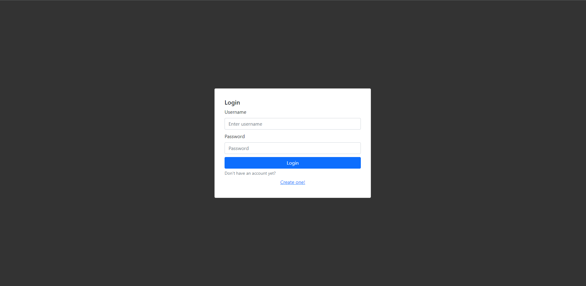
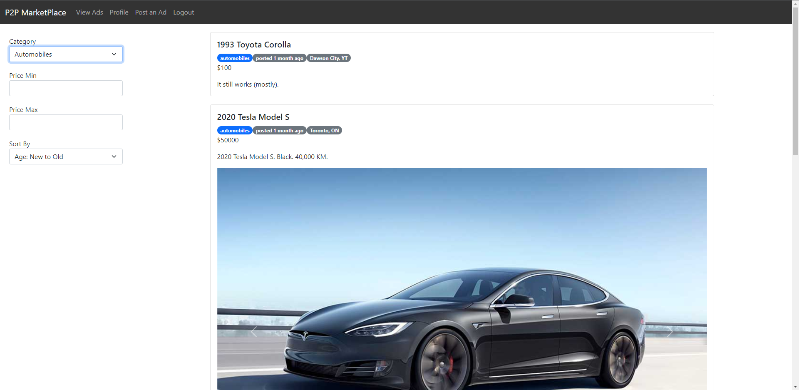
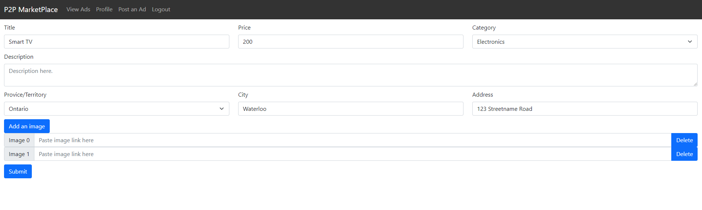
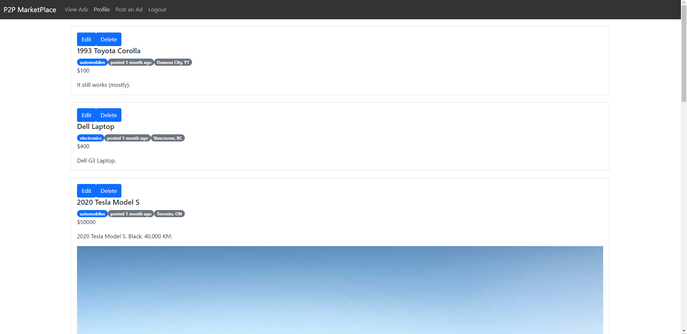

# P2PMarketplace

An e-commerce platform where users can browse, post, edit, and delete ads.

### Technologies Used

This is a full-stack web application build with the MERN stack (MongoDB, Express, React, and Node.js) and React-Bootstrap.

### Screenshots of the App

Login screen:

Browse ads screen:

Post/edit ad screen:

Profile screen:

